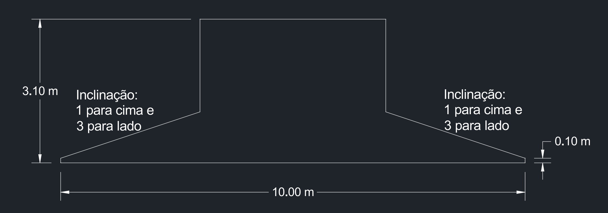

# Dimensões Geométricas da Sapata

- **Altura** (h):
    - Vai da base inferior da sapata até limite superior, que fica no nível do solo.
    - Deve medir, no mínimo, 30% do tamanho do maior lado da base da sapata.
- **Altura do paralelepípedo reto da base**:
    - No mínimo 0,10 m = 10 cm 
- **Inclinação a partir do paralelepípedo reto da base**:
    - Sobe-se 1 unidade enquanto se desloca 3 unidades para o lado.

## Caracterização geométrica de sapatas como rígidas ou flexíveis
- Conforme Normativo NBR 6118:2024 Estruturas de Concreto Armado,
    - Quando se verifica a expressão a seguir,
    - considerando as duas direções dos lados do paralelepídedo da base da sapata 
    - a consideramos como **rígida**. 
        - Se a expressão não for verificada, considera-se que a sapata é do tipo **flexível**.
$$
h \geq \frac{a - a_p}{3}
$$
- onde:
    - h := altura da sapata
    - a := dimensão de um dos lados da base da sapata
    - $a_p$ := dimensão do pilar considerando mesma direção escolhida do lado da base da sapata.
- Exemplos:
    - Uma sapata:
        - instalada embaixo de um pilar de seção transversal 0,20 x 0,40 metros,
        - com altura do paralelepípedo da base igual a 0,20 m
        - com altura da sapata igual a 3 m
        - com lados do paralelepípedo da base iguais a 5 x 6 m
        - Considerando o lado de 5 metros do paralepípedo da sapata e 0,2 m do lado da seção transversal do pilar, temos a seguinte expressão:
            - $3 \geq \frac{5 - 0,2}{3}$ 
            - $3 \geq 1,6$ (VERDADEIRO)
            - **Concluímos que a sapata é do tipo rígida**.
        - Considerando o lado de 6 metros do paralepípedo da sapata e 0,4 m do lado da seção transversal do pilar, temos a seguinte expressão:
            - $3 \geq \frac{6 - 0,4}{3}$ 
            - $3 \geq 1,87$ (VERDADEIRO)
            - **Concluímos que a sapata é do tipo rígida**.
    - Uma outra sapata:
        - instalada embaixo de um pilar de seção transversal 0,50 x 0,50 metros,
        - com altura do paralelepípedo da base igual a 0,20 m
        - com altura da sapata igual a 1,6 m
        - com lados do paralelepípedo da base iguais a 5 x 5 m
        - Considerando o lado de 5 metros do paralepípedo da sapata e 0,5 m do lado da seção transversal do pilar, temos a seguinte expressão:
            - $1,6 \geq \frac{5 - 0,5}{3}$ 
            - $1,6 \geq 1,5$ (FALSO)
            - **Concluímos que esta outra sapata é do tipo flexível**.

    